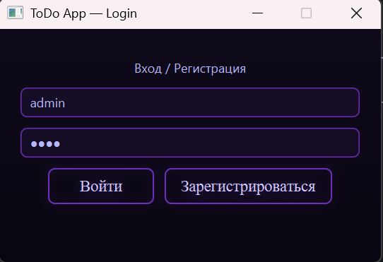
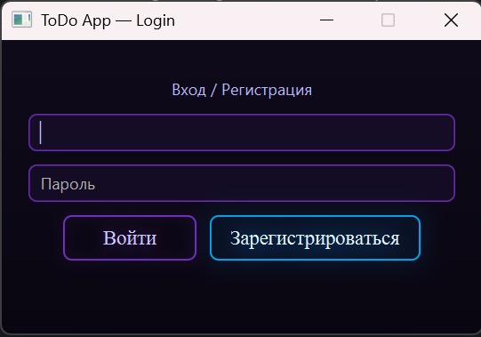
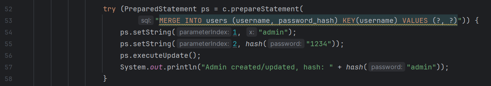
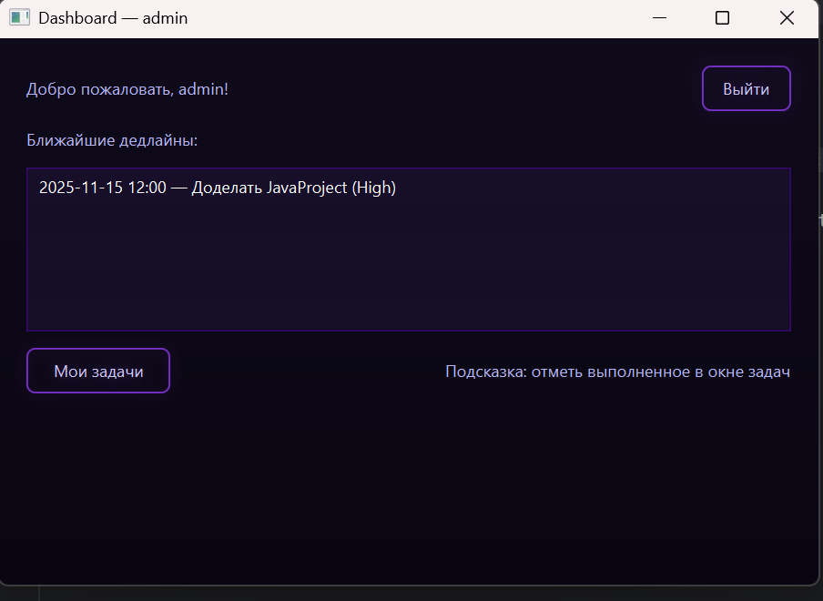
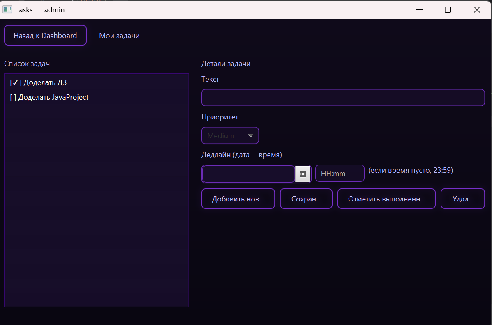
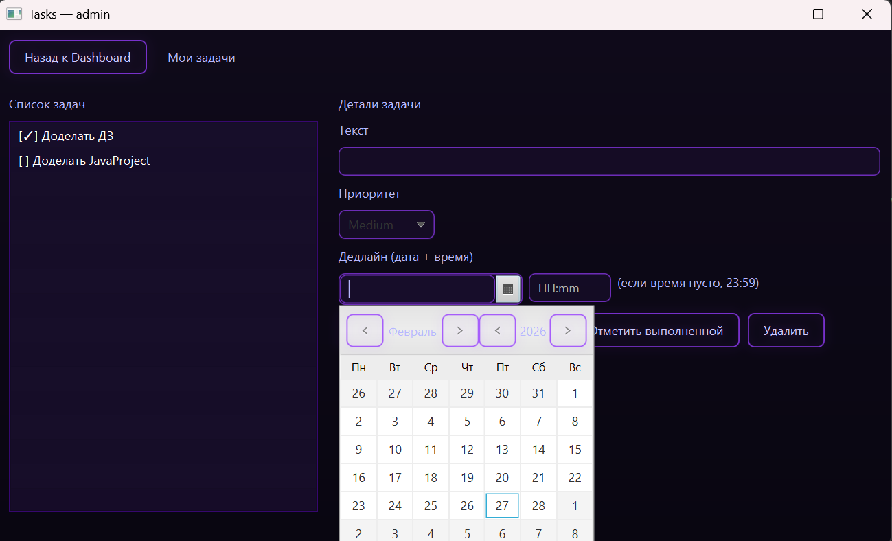

<h1 align="center">🗂 MyTasks — JavaFX Task Manager</h1>

<p align="center">
  <em>Десктопное приложение для управления задачами с авторизацией и разграничением данных пользователей</em>
</p>

<p align="center">
  
  
  
  
</p>

---

## 🌟 О проекте

MyTasks — это десктопное JavaFX-приложение для управления задачами с системой регистрации и авторизации.

Каждый пользователь видит **только свои задачи**.  
Данные хранятся в локальной базе **H2**.  
Пароли пользователей **шифруются перед сохранением**.

Проект демонстрирует:
- работу с JavaFX
- MVC-структуру
- взаимодействие с БД
- шифрование паролей
- разграничение пользовательских данных

---

## 🔐 Авторизация и регистрация

Отдельного окна регистрации нет.

Пользователь вводит логин и пароль:
- Нажимает **«Зарегистрироваться»** — создаётся новый пользователь
- Нажимает **«Войти»** — выполняется авторизация

Если пользователь уже существует — регистрация не пройдёт.

<figure align="center">
  
  <figcaption><em>Рис. 1 — Логин </em></figcaption>
</figure>


<figure align="center">
  
  <figcaption><em>Рис. 2 — Регистрация (тот же экран, нужно нажать на "Зарегистрироваться")</em></figcaption>
</figure>

---

## 👤 Дефолтный пользователь

При первом запуске автоматически создаётся пользователь по умолчанию.

Изменить логин и пароль дефолтного пользователя можно в файле:
```bash
src/main/java/com/example/javafxh2app/db/DB.java
```
на строках 54 и 55

### 👤 Пример дефолтного пользователя
<figure align="center">
  
  <figcaption><em>Рис. 3 — Фрагмент кода для смены дефолт пользователя.</em></figcaption>
</figure>

---

## 📋 Работа с задачами

После входа пользователь попадает на Dashboard.

### 🏠 Главная страница
<figure align="center">
  
  <figcaption><em>Рис. 4 — Главное окно. Дашборд.</em></figcaption>
</figure>

---

## ➕ Создание задачи

Можно указать:
- 📅 дату
- ⏰ время
- ⚡ уровень важности (High / Medium / Low)


<figure align="center">
  
  <figcaption><em>Рис. 5 — Окно создания задачи.</em></figcaption>
</figure>


<figure align="center">
  
  <figcaption><em>Рис. 6 — Окно создания задачи. Выбор даты.</em></figcaption>
</figure>

---

## ✏ Редактирование задачи

В окне редактирования можно:
- изменить данные
- отметить задачу как выполненную
- сохранить изменения (обязательно нажать "Сохранить")

---

## 🗑 Удаление задач

Пользователь может:
- удалить любую свою задачу
- создавать новые задачи без ограничений

---

## 🔒 Безопасность

- Пароли хранятся в зашифрованном виде
- Каждый пользователь видит только свои задачи
- Доступ к данным строго изолирован

---

## 🛠 Технологии

- Java 17+
- JavaFX
- H2 Database
- Maven
- JDBC
- Хэширование паролей

---

## 📦 Запуск проекта

### 1️⃣ Клонирование

```bash
git clone https://github.com/xenonim-ctrl/MyTasks-app.git
cd MyTasks-app
